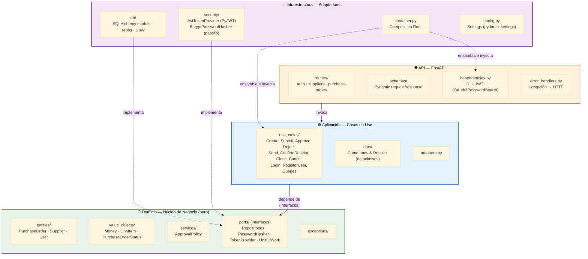
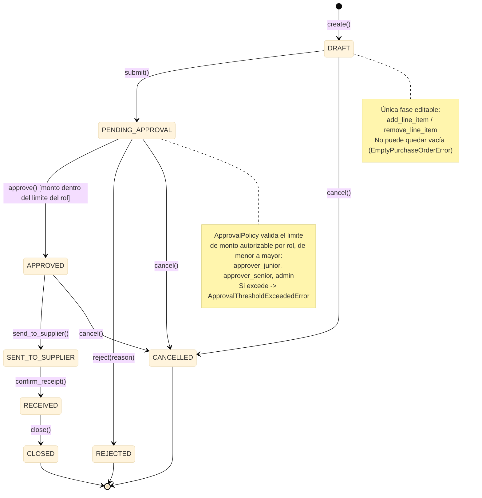
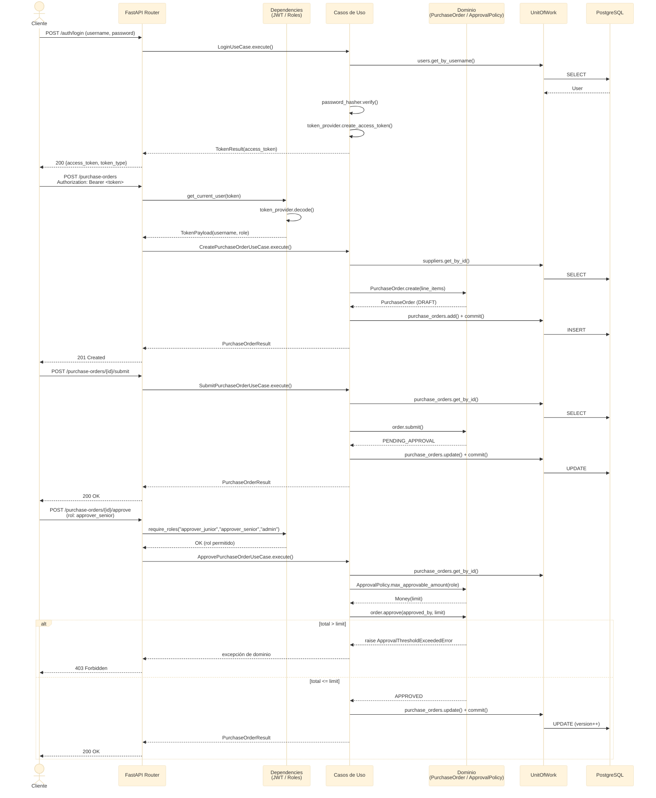
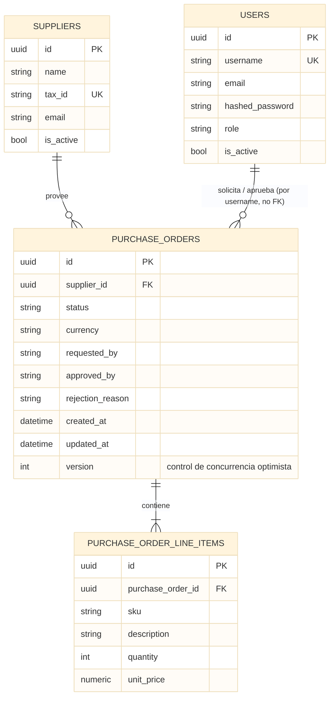
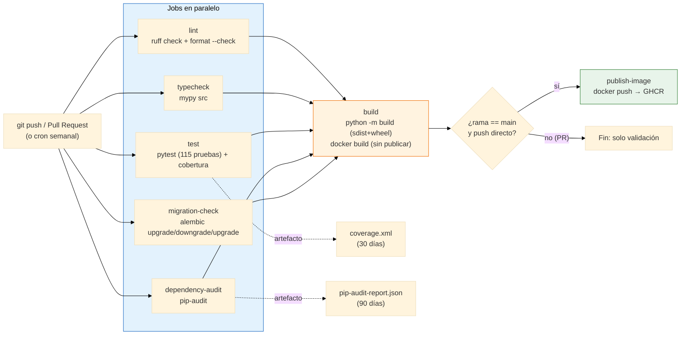

# Diagramas del Proyecto

Todos los diagramas están escritos en [Mermaid](https://mermaid.js.org/) y se renderizan automáticamente al ver este archivo en GitHub, GitLab, o el propio VS Code (extensión *Markdown Preview Mermaid Support*).

El código fuente de cada diagrama también vive en su propio archivo `.mmd` en esta carpeta, por si necesitas editarlo o pegarlo directamente en el [Mermaid Live Editor](https://mermaid.live/) para exportarlo como PNG/SVG de alta resolución.

> **Validación realizada**: la gramática de `er-diagram.mmd` y `sequence-create-approve-flow.mmd` fue verificada programáticamente con el parser real de `mermaid` (Node.js). Los diagramas de tipo `flowchart` y `stateDiagram` (`architecture-hexagonal`, `ci-cd-pipeline`, `state-machine-purchase-order`) no pudieron validarse por el mismo medio en este entorno (limitación de `DOMPurify` bajo `jsdom` sin navegador real disponible), por lo que se revisaron manualmente línea por línea; se corrigieron dos problemas reales encontrados en esa revisión (un `\n` literal mal usado y símbolos `<`/`>` sueltos que Mermaid podría confundir con HTML dentro de una nota).

---

## 1. Arquitectura Hexagonal (capas y dirección de dependencias)

*Fuente: [`architecture-hexagonal.mmd`](architecture-hexagonal.mmd)*



> Las flechas continuas indican invocación/uso; las punteadas indican 'implementa la interfaz de'. Nótese que **Infraestructura** es la única capa que conoce simultáneamente al Dominio (para implementar sus puertos) y a la API (para inyectarse en ella vía el `Container`).

---

## 2. Máquina de Estados de la Orden de Compra

*Fuente: [`state-machine-purchase-order.mmd`](state-machine-purchase-order.mmd)*



> Implementada en `domain/value_objects/purchase_order_status.py`. Cualquier transición no dibujada aquí es inválida y lanza `InvalidPurchaseOrderStateError` (HTTP 409).

---

## 3. Secuencia: Login → Crear Orden → Aprobar

*Fuente: [`sequence-create-approve-flow.mmd`](sequence-create-approve-flow.mmd)*



> Ilustra cómo la API traduce JWT a `TokenPayload`, cómo los casos de uso orquestan puertos vía `UnitOfWork`, y cómo `ApprovalPolicy` (servicio de dominio) decide si el monto está dentro del límite del rol.

---

## 4. Modelo de Datos (Entidad-Relación)

*Fuente: [`er-diagram.mmd`](er-diagram.mmd)*



> `requested_by` / `approved_by` se guardan como `username` (string), no como *foreign key* a `users`, para mantener el agregado `PurchaseOrder` desacoplado del ciclo de vida de las cuentas de usuario.

---

## 5. Pipeline de CI/CD

*Fuente: [`ci-cd-pipeline.mmd`](ci-cd-pipeline.mmd)*



> Los 5 jobs de validación corren en paralelo; `build` solo se ejecuta si todos pasan. La publicación de imagen a GHCR solo ocurre en push directo a `main` (no en Pull Requests).

---

## Cómo generar imágenes PNG/SVG a partir de estos diagramas

```bash
# Opción 1: Mermaid CLI (requiere Node.js + Chrome/Chromium disponible)
npm install -g @mermaid-js/mermaid-cli
mmdc -i docs/diagrams/architecture-hexagonal.mmd -o docs/diagrams/architecture-hexagonal.png

# Opción 2: pegar el contenido del .mmd en https://mermaid.live/
# y usar el botón 'Actions -> Export image'
```
